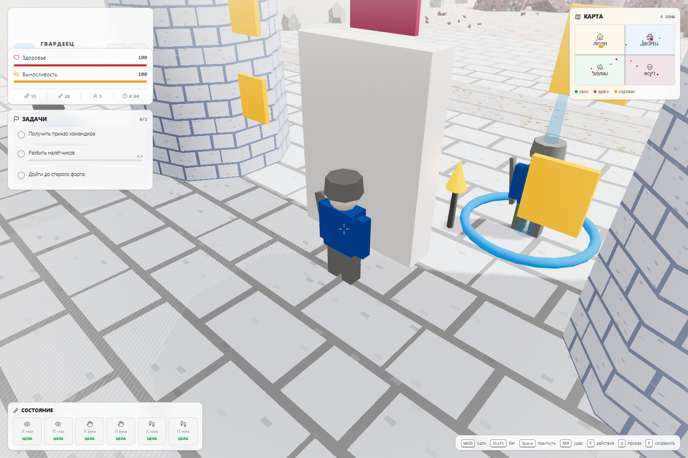
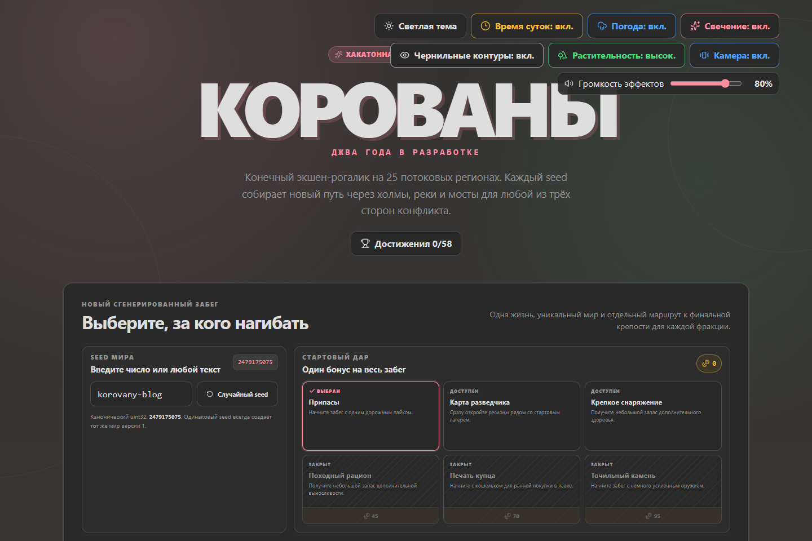
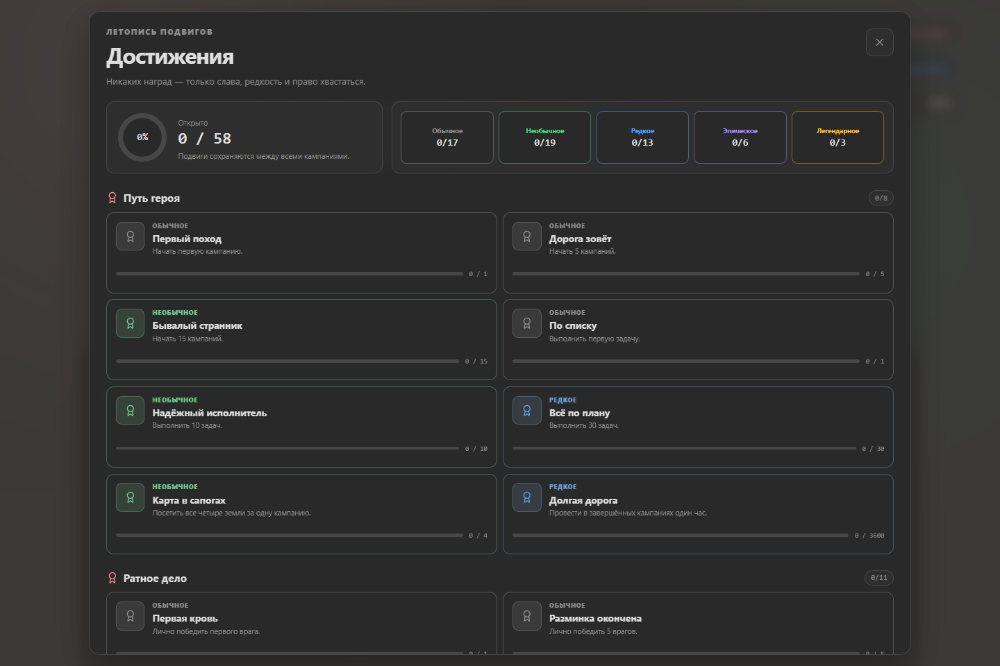

# From Four Zones to a Seeded Campaign

*How Korovany grew from a compact 3D joke game into a deterministic action roguelite in four very busy days.*

On July 14, 2026, the first public commit of **Korovany** already had the outline of a complete game: three factions, a seamless world, melee combat, quests, trading, injuries, saves, and a procedural soundtrack. It was small, direct, and recognizably inspired by the legendary Russian game-design meme.

Four days later, the same project can build a reproducible 25-region campaign from any text or numeric seed, stream that world around the player, preserve an active run, track a persistent profile, and turn every fight into a tiny comic-book set piece.

*The current development build: a generated forest start during a storm. The minimap now represents one discovered region out of a 5x5 campaign.*

This is the story of what changed between commit `2005a27` and the current working version.

## A surprisingly complete starting point

The initial game was not a blank prototype. Its single, handcrafted world connected four distinct lands without loading screens: the human village, imperial palace, elven forest, and villain's fort. Each of the three playable factions began in a different corner and followed its own three-part objective chain.

*The first menu presented the whole game at once: three factions, four lands, one campaign.*

The identity was already there:

- blocky characters and buildings made entirely in code;
- procedural pixel textures, trees, clouds, roads, and torches;
- melee combat, squads, caravan raids, injuries, prosthetics, healing, and trading;
- a generated 8-bit soundtrack with faction and zone variations;
- local save and load support;
- no external art or audio assets.

The original scale kept everything understandable. A four-quadrant minimap described the entire world, all major actors existed at once, and completing three objectives ended the campaign.

*The palace-guard start in the initial commit. The original four-zone map is visible in the upper-right corner.*

That compactness was also the limit. Runs could be finished quickly, the world was identical on every restart, and adding more terrain or actors would have amplified the cost of a monolithic simulation.

## First, make the existing game feel better

The first wave of work deepened the original world instead of replacing it. Faction combat gained more meaningful abilities and objective fixes. Dynamic events introduced rescue missions, champions, bounties, defensive encounters, and richer caravans. Escalating threat, repeatable upgrades, and continued play after the faction finale gave gold and combat a purpose beyond the first three objectives.

Movement and fighting also became more physical. Character collision stopped actors from walking through walls. Gate-aware navigation helped NPCs find valid routes. Enemies gained anticipation, recovery, flinches, staggers, knockback, poise, varied deaths, and more natural idle and movement blends.

The result was not simply "more enemies." Encounters became easier to read. A heavy attack now has a beginning, a point of impact, and a recovery. Different opponents can feel dangerous for different reasons without abandoning the deliberately simple controls.

## Then, make the world breathe

The second wave changed the atmosphere:

- a full day-night cycle added a moving sun and moon, stars, moonlit geometry, and brighter torches and windows after dark;
- zone-driven weather brought rain and other regional conditions;
- wind-animated ground foliage made empty terrain feel active;
- bloom added restrained glow around emissive details;
- distant billboard trees were removed so the world kept its 3D silhouette at every range.

All of these systems remained optional. The menu and pause screen grew into a practical visual-settings panel for day-night simulation, weather, bloom, ink outlines, foliage quality, camera accents, theme, and sound-effect volume.

This mattered because procedural visuals need strong art direction. Randomness can create variety, but lighting, color, motion, and silhouettes are what make that variety belong to the same game.

## Finding a comic-book language

The next set of changes gave combat a visual grammar of its own. Toon shading and selective outlines improved character separation without outlining every object in the scene. Hits gained flashes, speed lines, readable telegraphs, impact text, and deliberately exaggerated but bounded camera accents.

Loot received rarity colors, bursts, and reward toasts. Combat audio became layered instead of relying on isolated effects. Zone art direction introduced distinct motifs and accent colors so the forest, palace, fort, and neutral lands could be recognized through more than geometry.

The important word is *bounded*. Screen shake, field-of-view kicks, bloom, outlines, and hit effects all have settings or intensity limits. The game can be loud without becoming illegible.

## The real transformation: the map became data

The largest change did not begin with a shader. It began by separating the idea of a world from the meshes currently visible on screen.

The fixed four-zone layout is now joined by a deterministic generator. A seed produces a `WorldBlueprint`: a 5x5 region graph with terrain profiles, biomes, faction territory, a river, crossings, roads, bridges, sites, encounters, and objective routes. A validator checks the result, and a fingerprint makes determinism measurable.

The text seed used for these screenshots, `korovany-blog`, resolves to canonical seed `2479175075`.

*Starting a run now means choosing a faction, a reproducible world seed, and a profile boon.*

Generation is only half of the solution. The runtime streams nearby regions rather than keeping an arbitrarily large world alive at once:

- `RegionManager` decides what should be loaded around the player;
- `TerrainSystem` builds sampled ground, hills, roads, rivers, and crossings;
- `GeneratedWorldRuntime` materializes regions and applies their saved deltas;
- `CollisionWorld` provides spatial queries for terrain and obstacles;
- `NavigationSystem` routes actors through a world that can change under them.

*The menu preview exposes the campaign structure before the run starts: territory, river, bridges, faction start, and finale.*

This architecture changes the meaning of replayability. A new run is no longer the same level with reset enemies. It is a finite campaign assembled from a stable seed, with a faction-specific start, route, encounters, and final stronghold.

It also gives debugging a better foundation. If an interesting bridge, impossible route, or encounter bug appears, the seed is a compact reproduction case.

## Runs became journeys

A generated world needs a different save model. The original version-1 save captured one position in one fixed map. The new run format separates three kinds of state:

1. immutable run configuration, including seed, faction, and generator version;
2. serializable player and campaign state;
3. per-region deltas for things the player changed.

Active runs can be suspended and continued. Victory, defeat, and abandonment become terminal records in run history. The old four-zone save still has its own load path, so the architectural transition does not erase an existing campaign.

A persistent profile now sits above individual runs. Profile currency unlocks starting boons, while selected faction and boon choices make it faster to begin the next journey.

Achievements provide the long-term scrapbook. There are 58 across campaign progress, combat, exploration, economy, injuries, faction play, and unusual challenges, with five rarity tiers and hidden entries.

*Achievements are deliberately bragging rights rather than mandatory power. Progress persists across campaigns.*

The system is wired to real game events rather than inferred from the UI: kills by faction and role, purchases, caravans, objectives, world events, damage, injuries, abilities, victories, defeats, and more. Unlocks are queued so a burst of progress does not collapse into a single notification.

## By the numbers

The difference is visible in the repository as well as on screen.

| Measure | Initial commit | Current working version |
| --- | ---: | ---: |
| Source files (`src`, TypeScript and CSS) | 6 | 28 |
| Source lines | 5,265 | 31,882 |
| Campaign geography | 4 fixed zones | 25 generated regions |
| Persistent achievements | 0 | 58 |
| Save families | 1 legacy campaign | legacy campaign, active run, profile, history |

The source has grown to roughly six times its original size, but the more important change is its shape. Random streams, world generation, terrain, collision, navigation, region streaming, profile state, and run storage now live in focused modules. Deterministic tests cover those boundaries, making seeds and serialized state useful engineering tools rather than marketing labels.

## What did not change

Despite the larger architecture, Korovany still revolves around the same promise: choose forest elves, palace guards, or the villain; cross a strange low-poly world; fight, trade, recruit, lose body parts, replace them with questionable machinery, and eventually do something about a caravan.

It is still rendered from procedural geometry and textures. The music and effects are still synthesized. The controls are still intentionally small. Most importantly, the joke is still treated seriously enough to become a real game.

The initial commit proved the premise. The current version proves that the premise can support a campaign system. The next interesting question is no longer whether four zones contain enough game - it is how many memorable worlds can be hidden inside a seed.
