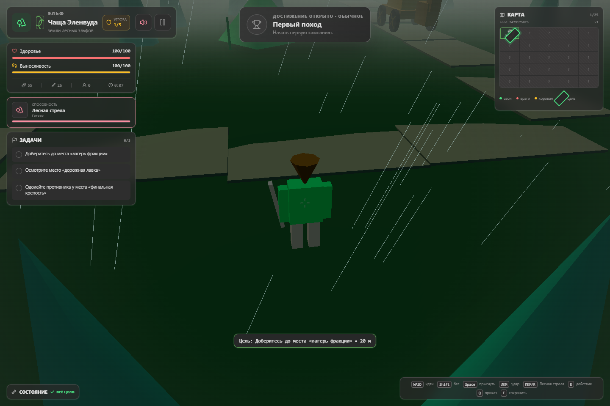
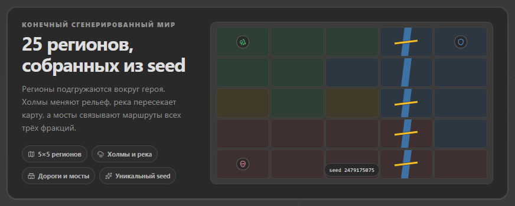

# От четырёх зон к кампании, собранной из seed

**Язык:** [English](from-four-zones-to-a-seeded-campaign.md) | Русский

*Как «КОРОВАНЫ» за четыре очень насыщенных дня выросли из компактной 3D-игры по мотивам мема в детерминированный экшен-рогалик.*

14 июля 2026 года в первом публичном коммите **«КОРОВАНЫ»** уже угадывалась законченная игра: три фракции, бесшовный мир, ближний бой, задания, торговля, травмы, сохранения и процедурный саундтрек. Она была небольшой, прямолинейной и безошибочно узнаваемой как воплощение легендарного русскоязычного геймдизайнерского мема.

Четыре дня спустя тот же проект умеет собирать воспроизводимую кампанию из 25 регионов по любому текстовому или числовому сиду, подгружать мир вокруг игрока, сохранять активный забег, вести постоянный профиль и превращать каждую драку в маленькую сцену из комикса.

*Текущая версия в разработке: старт лесных эльфов в сгенерированном мире во время грозы. На мини-карте открыт один регион из кампании 5x5.*

Это рассказ о том, что изменилось между коммитом `2005a27` и текущей рабочей версией.

## Неожиданно законченная отправная точка

Первая версия не была пустым прототипом. Её единый, вручную спроектированный мир без загрузочных экранов соединял четыре разные земли: человеческую деревню, императорский дворец, эльфийский лес и форт злодея. Каждая из трёх игровых фракций начинала в своём углу карты и проходила собственную цепочку из трёх заданий.

*Первое меню показывало всю игру сразу: три фракции, четыре земли, одна кампания.*

Характер игры уже сложился:

- угловатые персонажи и здания, целиком созданные кодом;
- процедурные пиксельные текстуры, деревья, облака, дороги и факелы;
- ближний бой, отряды NPC, налёты на корованы, травмы, протезы, лечение и торговля;
- генерируемый 8-битный саундтрек с вариациями для фракций и зон;
- локальные сохранения и загрузка;
- никаких внешних графических или звуковых ресурсов.

Исходный масштаб помогал охватить игру целиком. Мини-карта из четырёх квадрантов описывала весь мир, все важные персонажи существовали одновременно, а выполнение трёх заданий завершало кампанию.

*Старт дворцовой охраны в первом коммите. В правом верхнем углу видна первоначальная карта из четырёх зон.*

Но компактность была и главным ограничением. Забег можно было закончить очень быстро, после перезапуска мир оставался прежним, а добавление новых территорий или персонажей лишь увеличивало стоимость монолитной симуляции.

## Сначала — сделать приятнее уже существующую игру

Первая волна изменений углубила исходный мир, а не заменила его. Фракционный бой получил более выразительные способности, а цепочки заданий — важные исправления. Динамические события добавили спасательные операции, чемпионов, награды за головы, оборонительные столкновения и более богатые корованы. Растущая угроза, повторяемые улучшения и возможность продолжить игру после фракционного финала дали золоту и сражениям смысл за пределами первых трёх задач.

Движение и бой тоже стали ощутимо физичнее. Коллизии больше не позволяли персонажам проходить сквозь стены. Навигация с учётом ворот помогла NPC искать допустимые маршруты. У противников появились замахи, восстановление после атак, вздрагивания, оглушения, отбрасывание, стойкость, разные анимации смерти и более естественные переходы между покоем и движением.

Результатом стали не просто «ещё враги». Столкновения стало легче читать. У тяжёлой атаки теперь есть подготовка, момент удара и восстановление. Разные противники опасны по разным причинам, хотя управление намеренно остаётся простым.

## Затем — вдохнуть в мир жизнь

Вторая волна изменений занялась атмосферой:

- полноценный цикл дня и ночи добавил движущиеся солнце и луну, звёзды, лунное освещение геометрии, а также более яркие факелы и окна после заката;
- погода стала зависеть от зоны и принесла дождь и другие региональные условия;
- трава, колышущаяся на ветру, оживила пустые участки земли;
- bloom добавил сдержанное свечение эмиссивным деталям;
- далёкие плоские спрайты деревьев исчезли, поэтому мир сохраняет объёмный силуэт на любой дистанции.

Все эти системы остались настраиваемыми. Меню и экран паузы превратились в практичную панель визуальных параметров: цикл дня и ночи, погода, bloom, чернильные контуры, качество растительности, акценты камеры, тема и громкость звуковых эффектов.

Это важно, потому что процедурной графике особенно нужна сильная арт-режиссура. Случайность создаёт разнообразие, но именно свет, цвет, движение и силуэты превращают это разнообразие в части одной игры.

## Свой язык комикса

Следующий набор изменений подарил бою собственную визуальную грамматику. Toon-шейдинг и выборочные контуры лучше отделили персонажей от окружения, не обводя при этом каждый объект сцены. Удары получили вспышки, линии скорости, читаемые предупреждения, текст в момент попадания и намеренно преувеличенные, но ограниченные акценты камеры.

У добычи появились цвета редкости, эффектные выбросы и всплывающие карточки наград. Боевой звук стал многослойным вместо набора одиночных эффектов. Арт-режиссура зон ввела отдельные мотивы и акцентные цвета, поэтому лес, дворец, форт и нейтральные земли теперь различаются не только геометрией.

Ключевое слово здесь — *ограниченные*. Тряска экрана, скачки угла обзора, bloom, контуры и эффекты попаданий имеют настройки или пределы интенсивности. Игра может быть громкой, не переставая быть читаемой.

## Настоящее превращение: карта стала данными

Самое крупное изменение началось не с шейдера. Оно началось с разделения самого понятия мира и мешей, которые прямо сейчас видны на экране.

К фиксированной карте из четырёх зон присоединился детерминированный генератор. Сид создаёт `WorldBlueprint`: граф из 25 регионов с профилями рельефа, биомами, территориями фракций, рекой, переправами, дорогами, мостами, локациями, столкновениями и маршрутами заданий. Валидатор проверяет результат, а цифровой отпечаток позволяет измерить детерминизм.

Текстовый сид из этих скриншотов, `korovany-blog`, превращается в каноническое число `2479175075`.

*Теперь перед забегом нужно выбрать фракцию, воспроизводимый сид мира и стартовый дар из профиля.*

Генерация — лишь половина решения. Во время игры движок подгружает соседние регионы, а не пытается постоянно держать в памяти мир произвольного размера:

- `RegionManager` решает, что нужно загрузить вокруг игрока;
- `TerrainSystem` строит семплированную поверхность, холмы, дороги, реки и переправы;
- `GeneratedWorldRuntime` материализует регионы и применяет сохранённые изменения;
- `CollisionWorld` выполняет пространственные запросы к рельефу и препятствиям;
- `NavigationSystem` проводит персонажей через мир, способный меняться прямо под ногами.

*Ещё до старта меню показывает структуру кампании: территории, реку, мосты, начало пути фракции и финал.*

Эта архитектура меняет само значение реиграбельности. Новый забег — уже не тот же уровень с заново расставленными врагами. Это конечная кампания, собранная по стабильному сиду, со стартом, маршрутом, столкновениями и финальной крепостью для выбранной фракции.

Отладка тоже получает более прочную основу. Если в игре встретится интересный мост, непроходимый маршрут или ошибка в столкновении, сид станет компактным сценарием воспроизведения.

## Забеги стали путешествиями

Сгенерированному миру нужна другая модель сохранений. Сохранение первой версии содержало одну позицию на одной фиксированной карте. Новый формат забега разделяет три вида состояния:

1. неизменяемую конфигурацию забега, включая сид, фракцию и версию генератора;
2. сериализуемое состояние игрока и кампании;
3. изменения в отдельных регионах, оставленные игроком.

Активный забег можно приостановить и продолжить. Победа, поражение и отказ от похода становятся окончательными записями в истории. У старого сохранения для четырёх зон остался отдельный путь загрузки, поэтому архитектурный переход не стирает уже начатую кампанию.

Над отдельными забегами теперь существует постоянный профиль. Валюта профиля открывает стартовые дары, а сохранённый выбор фракции и дара позволяет быстрее отправиться в следующее путешествие.

Достижения стали общей летописью подвигов. Всего их 58: за прогресс в кампании, бой, исследование, экономику, травмы, игру за разные фракции и необычные испытания. Есть пять уровней редкости и скрытые достижения.

*Достижения дают право похвастаться, а не обязательное усиление. Прогресс сохраняется между кампаниями.*

Система подключена к настоящим игровым событиям, а не пытается угадать их по интерфейсу: убийства по фракциям и ролям, покупки, корованы, задания, события мира, урон, травмы, способности, победы, поражения и многое другое. Открытия выстраиваются в очередь, поэтому всплеск прогресса не схлопывается в одно уведомление.

## В цифрах

Разницу видно не только на экране, но и в репозитории.

| Показатель | Первый коммит | Текущая рабочая версия |
| --- | ---: | ---: |
| Исходные файлы (`src`, TypeScript и CSS) | 6 | 28 |
| Строки исходного кода | 5 265 | 31 882 |
| География кампании | 4 фиксированные зоны | 25 сгенерированных регионов |
| Постоянные достижения | 0 | 58 |
| Семейства сохранений | 1 старая кампания | старая кампания, активный забег, профиль, история |

Объём исходного кода вырос примерно в шесть раз, но важнее изменилась его форма. Потоки случайных чисел, генерация мира, рельеф, коллизии, навигация, подгрузка регионов, состояние профиля и хранение забега теперь живут в отдельных специализированных модулях. Детерминированные тесты охватывают эти границы, превращая сиды и сериализованное состояние в полезные инженерные инструменты, а не просто слова для рекламного текста.

## Что не изменилось

Несмотря на выросшую архитектуру, в основе «КОРОВАНОВ» остаётся то же обещание: выбрать лесных эльфов, дворцовую охрану или злодея; пересечь странный low-poly мир; драться, торговать, собирать отряд, терять части тела, заменять их сомнительными механизмами и в конце концов что-нибудь сделать с корованом.

Игра по-прежнему рисует себя процедурной геометрией и текстурами. Музыка и эффекты всё ещё синтезируются. Управление всё так же намеренно невелико. А главное — к шутке по-прежнему относятся достаточно серьёзно, чтобы она становилась настоящей игрой.

Первый коммит доказал жизнеспособность идеи. Текущая версия доказывает, что на этой идее можно построить систему кампаний. Теперь главный вопрос не в том, хватит ли для игры четырёх зон, а в том, сколько запоминающихся миров может скрываться внутри одного сида.
