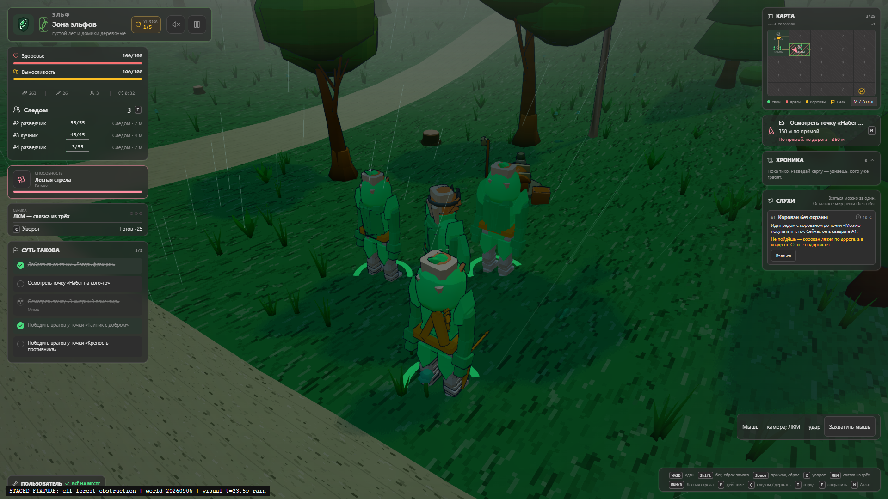
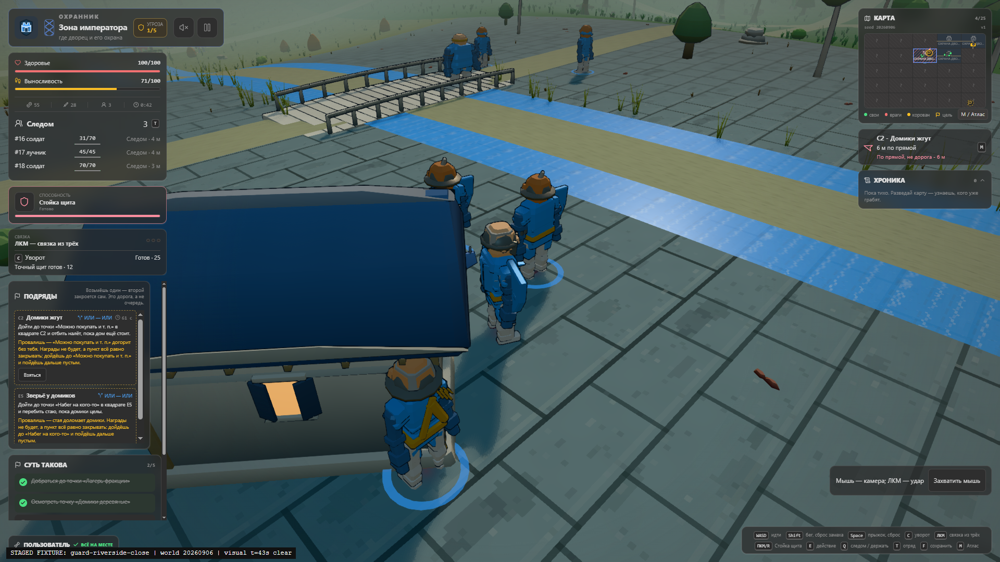
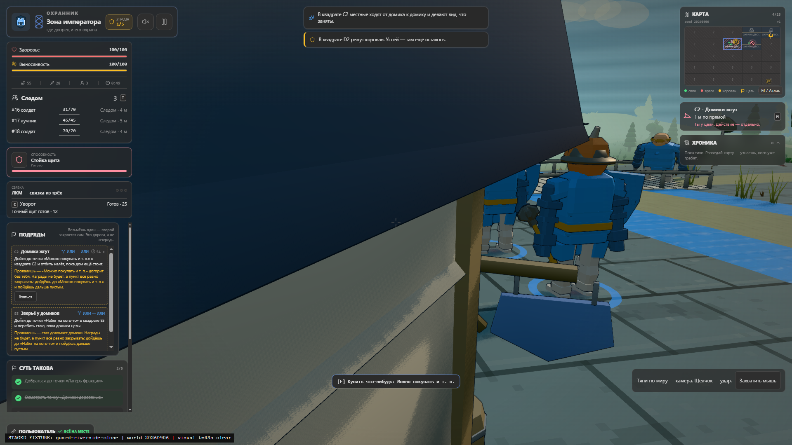
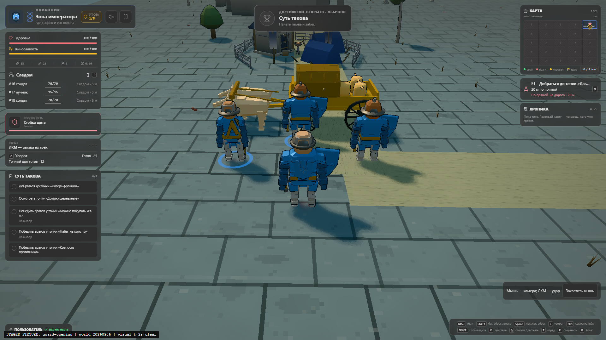
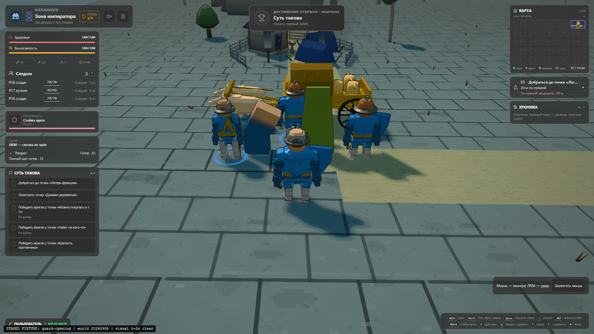
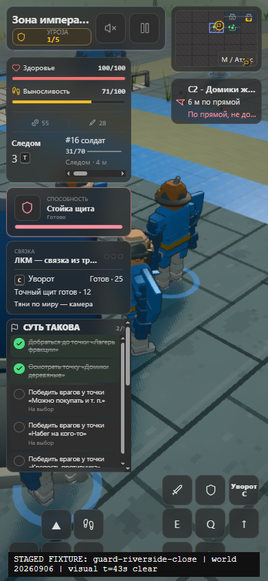

# GFX-02: measured foundation, with an open temporal camera defect

**The enhanced foundation renders and the initial obstruction cases improve.
The full camera acceptance gate is NOT met:** after the riverside native-input
route, the roof/wall hides the player's torso. All 14 runner jobs succeeded, but
their success is not a visual verdict. This report preserves the failing endpoint
alongside the improved initial frames, before its separately authorized correction.

Measured runtime: `bfae58b34a411ab434d387e6710fd97be6b2acb3`.
The source, built HTML and workload stayed unchanged during the batch. This
evidence does not apply to later camera fixes, character/world content, or the
allocation-only descendant `3d2a77e`.

[API and ownership contract](gfx-02-rendering.md) |
[Evidence index and all raw hashes](images/gfx-02-evidence/evidence.json) |
[Machine-readable assessment](images/gfx-02-evidence/summary.json) |
[Original GFX-01 baseline](graphics-baseline-results.md)

## What ran

The corrected, parent-supervised window ran from **21:25:36 to 21:32:08 UTC on
2026-09-09**. Workload SHA-256:
`4addf5fd3fd1770b2f70e384446c86504078417a7eb651417ec30d17ce8c0839`.
Built HTML SHA-256:
`368b220caff1b70dd9b35f9ceda3ab294677e60a41ad19a207fdc137805f3ec1`.

The batch contains **32 cases, 35 initial captures, 11 active profiles, 144
manual-motion images and 12 real menu/Continue/destruction cycles**. Each profile
has 120 warm-up and 300 sample frames: 1,320 warm-up and 3,300 steady frames.
All 314 original artifact files are indexed with SHA-256 hashes. Earlier failed
prelaunch attempts did not execute browser jobs and are not counted as evidence.

Hardware reported by the run: Ryzen 7 5800X, 16 logical processors, approximately
96 GiB RAM, NVIDIA RTX 4070 Ti SUPER, Windows 10 build 19045, Chrome 152,
THREE revision 185, **ANGLE/D3D11/WebGL2**. The actual
`EXT_disjoint_timer_query_webgl2` extension supplied GPU timings.
Whole-system CPU busy observations were **7.94% to 19.15%**. The machine was not
globally isolated; no power/thermal policy or causal observer tax is inferred.
The coordinator reports GFX-06's subsequent CPU checks started after this window.

This is explicit enhanced-preview evidence. Legacy remains the preference
default. Real mobile/integrated devices, sustained thermal behavior, completed
campaigns and full model/action acceptance are not established.

## Initial framing versus the moving-camera failure

| Recorded prerequisite | Initial result at 1920x1080 | Decision |
| --- | --- | --- |
| Forest contract obstruction | 10.000 m horizontal / 11.943 m boom; three foreground instances faded | Player and companions are no longer hidden by the central conifer |
| Riverside shop collision | 10.562 m horizontal / 12.856 m boom; shoulder candidate 1; player fully framed | Substantial improvement over GFX-01's 1.842 m horizontal view; roof still legitimately hides part of the left NPC |
| Riverside after native drag/strafe | 7.566 m horizontal / 7.809868 m boom; roof/wall at image center | **Fails torso visibility** in active-end and all 12 subsequent motion frames |

The forest initial frame recorded four admitted world-shadow draws, 24 submitted
instances / 10,600 triangles and 22 selected instances. The riverside frame
recorded six draws, 47 submitted instances / 9,124 triangles, 40 selected
instances, and five rejected batches. These are real production registrations;
the raw GL ledger separately confirms shadow submissions. The selected subset
is not substituted for submitted cost.







At the failing endpoint, player position is
`[13.411848615952803, 11.880030381648718, -95.35531828691352]`;
camera position is
`[14.799482397948509, 15.466387519159252, -102.79299494934922]`,
yaw `-1.6869327348976162`, pitch `0.38`, FOV 56.
The player-plus-1.65 m look target projects to the center of the image, where
the roof is visible instead of the torso. Zero collision-query overflow and a
nonzero boom do not establish target visibility. Candidate 3 is retained in the
post-route motion sequence. A narrow production-geometry correction and new
leased route proof are required; this report does not quietly waive that gate.

Four native routes (two with post, two direct) recorded 19 input events each,
0.336 radians of yaw change, and about 5.75 to 6.54 m of player travel. Chrome
refused native pointer lock; all four used the supported drag fallback.
**Successful pointer lock is still untested.** The saved prerequisites are
labelled staging, not natural replay of the original field run.

## Image stability, shaders and effects

Actual high-resolution FXAA chains submitted **16 post draws**; same-post no-AA
references submitted **15**. The bloom-off routes submitted **zero** in all 600
steady samples. Low also had no composer. Observed post/shadow targets were
single-sample; canvas AA was separately reported as four samples. There is no
claim that all bloom targets are multisampled.

Four initial AA/no-AA pairs have identical recorded camera, player, actor and
simulation-time values. Native-pixel crops of guard armor/helmet/weapon edges,
forest silhouettes and the riverside roof show reduced stair-stepping with
some expected subpixel softening; no definite missing weapon contour or random
uninitialized-color corruption was identified. This is a bounded visual
inspection, **not a universal blur/shimmer or driver-portability pass**.
The different active sequences are not frame-synchronized A/B benchmarks.



There were **zero browser error/exception events**, but warnings were retained:

| Warning | Recorded console messages | Assessment |
| --- | ---: | --- |
| `THREE.Clock` deprecated | 35 | Existing clock warning, not shader failure |
| ANGLE `X3595` gradient in varying loop and `X4000` potentially uninitialized `f_ApplyFXAA` | 10 | Program-info warnings from the FXAA path; unresolved portability caveat |

`ApplyFXAA`, its data-dependent edge-search loops and implicit-gradient texture
samples originate in the installed, unmodified three.js
`examples/jsm/shaders/FXAAShader.js`. The foundation passes that shader unchanged
to `ShaderPass`, sets its input resolution, and disables tone mapping on that
pass; it does not inject those functions. OutputPass remains the sole output
conversion. No vendor edit was made. Existing output and the absence of a
compile-error event do **not** prove the warnings harmless on another driver.

All 144 manual-motion PNGs were decoded and their 12 sequences inspected as
ordered real frames. No adjacent pair is pixel-identical. These are five
simulation steps apart, with approximately 0.917 s between first and last
images, not continuous 60 Hz video or RAF timing. Combat tells, moving NPCs and
precipitation remain visible. The reviewed forest route restores vegetation
outside the corridor; the riverside sequence exposes the failure above.
Motion-difference counts alone are not proof against holds, shimmer or camera
obstruction.

The joint production-material fixture rendered a two-bone skinned shape and two
wind-deformed instance shapes with source/ink and key shadows. One instance uses
camera-only fade. Source/ink vertex telemetry reports zero sampled position
error in all 24 paired motion frames; the real images show the skinned bend and
its ink, the wind shapes and projected shadows. This is stronger than an emitted
GLSL string check, but is not exhaustive pixel-by-pixel depth/normal validation
or a completed character rig. The fixture's camera-fade/shadow-independence field
is a declared behavior, not by itself a measurement of every shadow pixel.



Ink-off captures submitted **zero ink draws** while preserving source rendering.
Weather-off, night, rain, snow, reduced-motion and direct captures exist. The
matrix did not exercise every faction's player ability/defense/melee/interaction
sequence, injury/rebind, or hostile-hidden-by-wall case in a real browser.
Those remain broader integration checks, not inferred from the screenshot count.

## Actual pixels, not requested labels

| Job | Reported CSS game size | Actual 3D buffer | Post |
| --- | --- | --- | --- |
| Small initial smoke (requested 960x540) | 945x544 | 945x544 | FXAA |
| High desktop | 1920x1080 | 1920x1080 | FXAA or explicit comparison/direct |
| Balanced, device DPR 2 | 1280x720 | 1577x887 (1,398,799 pixels) | FXAA |
| Low desktop layout emulation | 390x844 | 331x717 | Direct |

The post owner's actual input sizes match the recorded buffer in every capture,
and none exceeds the resolved pixel ceiling. These are fresh-launch dimensions,
**not an in-session resize/DPR transition test**. The 390px HUD still overlays
much of the world; a correct small 3D buffer does not solve the full mobile HUD.



## Active performance and inherited overages

All entries are independently measured p95 distributions in milliseconds; do
not add component percentiles. Whole-frame draws include source, ink, shadow and
post. Different live fights, framing, workload and system load prevent a causal
speedup claim against GFX-01.

| Profile | RAF p95 | CPU total p95 | GPU p95 | Max draws | Max main-view triangles |
| --- | ---: | ---: | ---: | ---: | ---: |
| Forest route | 16.9 | 5.8 | 5.046 | 353 | 265,396 |
| Riverside route | 16.9 | 8.7 | 6.154 | 669 | 300,392 |
| Elf opening | 17.5 | 7.5 | 9.385 | 613 | 316,164 |
| Guard opening | 17.3 | 4.6 | 6.128 | 476 | 84,888 |
| Villain opening | 17.2 | 4.1 | 6.214 | 326 | 97,232 |
| Forest direct route | 16.9 | 5.5 | 7.586 | 337 | 265,396 |
| Riverside direct route | 16.9 | 9.3 | 6.099 | 653 | 300,392 |
| Balanced guard, DPR 2 | 17.3 | 5.3 | 3.825 | 435 | 74,834 |
| Balanced forest, DPR 2 | 16.9 | 5.9 | 6.555 | 349 | 228,420 |
| Crowded 25-NPC encounter | 17.5 | 11.0 | 11.561 | **1,512** | 179,760 |
| Streaming boundary | 17.6 | 5.0 | 7.057 | 427 | 124,432 |

The crowd retained **25 allocated NPCs in all 300 samples**, 21 to 25 alive and up
to 11 acting. Its 1,512 draws are above both the inherited GFX-01 peak of 1,423
and the proposed 700 High ceiling. Actors/caps were not reduced and budgets were
not raised. The +89 difference between maxima is not an isolated implementation
tax. The fixed chain adds one post draw over the old 15-draw chain; world-caster
admission is separately bounded. Later character batching remains necessary.

Across all 4,620 warm/steady frames, accumulated renderer and raw GL primitive
totals agree. Steady frames have zero `readPixels`, zero inactive samples, real
available GPU query results and no reported camera overflows or world-caster
budget violation. These counts do not invalidate the visibly obstructed camera.

The real streaming load into `region-3-0` allocated 567,196 API bytes, took
32.7 ms in streaming and **105.8 ms total CPU**, followed by a 106.7 ms RAF
interval. Return unload released 439,028 bytes, with 3.4 ms streaming / 6.8 ms
CPU. Retention makes unequal allocation/release totals possible without a leak.
The load spike remains an integration performance issue.

## Resource closure, with residue

High profiles peaked at approximately 103.90 to 105.95 MiB tracked API storage,
including 101.20 MiB of targets. Direct profiles peaked at 34.82/36.75 MiB with
32 MiB of shadow targets; Balanced targets were 54.71 MiB. Canvas resolve,
four-sample color and depth estimates add about 71.19 MiB at 1920x1080 and are
separate from the API ledger. Driver, swapchain and alignment overhead remain
unobserved; these are not resident-VRAM measurements.

The forest owns 2,803,752 bytes of binding geometry, including 36,456 bytes of
visibility/mask attributes; riverside owns 2,315,960 / 37,928 bytes. Attribute
bytes are a subset, not an extra amount to add. Shared/library resources and
bone textures are counted by the GL ledger when uploaded. CPU canonical sight
geometry/receipts are not automatically resident GPU storage.

All **12** measured teardown samples returned render-target bytes and VAOs to
zero. Eleven ended with **12,064 API bytes**, six texture handles, three
framebuffer handles and one or two program handles; geometry buffers were zero.
The first live crowd teardown retained **58,440 bytes**, including two buffers
(92 bytes), nine textures and two programs. Subsequent crowd cycles settled at
12,064 bytes. The old 33,566,496-byte target-heavy residue is no longer observed,
but this is **not complete resource closure or proof of zero VRAM leakage**.

The joint skin/wind fixture rendered, but did not run a dedicated instrumented
fixture-teardown cycle. Ordinary page reload/process cleanup is not a substitute
for that ownership measurement. GFX-06 owns final lifecycle acceptance.

## User direction and remaining gates

The user's assessment was that the guards were "ok-ish" and their uniform and
helmets should be retained, but elf heads looked like green pumpkins and villain
heads like pumpkins; the NPC models were not realistic enough. **This is not
approval of the current character models.** GFX-03 owns the next anatomical
head/face/hood/horn revision. This evidence-only checkpoint changes no anatomy,
shader, camera or public API.

The next necessary, separately leased proof is bounded: repeat the failing
riverside drag/strafe endpoint and motion after its narrow camera fix, check the
forest control, and exercise live resize/DPR transitions with post/direct and
ink inputs. Successful native lock, context recovery, the full faction-action
matrix, dedicated fixture teardown, sustained real-device performance, FXAA
portability and human model/tier/default approval remain open. No new GPU window
is implied by this document.

## Artifact preservation

This checkpoint commits 29 original PNGs (including every one of the 12 failing
riverside motion frames), all 14 runner manifests, 11 complete raw profiles,
35 capture metadata records, representative original warning logs and
batch/supervisor/workload provenance. JSON/profile compression is lossless and
both stored and original hashes are indexed. The original 314 files,
approximately 250.67 MiB, remain untouched at:

```text
C:\Users\predi\.copilot\session-state\071ce686-b3bf-4406-b482-0cad5b87136b\files\browser-windows
  \GFX02-BROWSER-20260909-01-PRELAUNCH2
  \gfx02-ba35ad41-077f-4783-afa8-5980af594925
```

CPU-derived contact sheets/native-pixel crops used for review are kept separately
in the session's `files\gfx02-motion-review`; they are not substituted for raw
captures. The original nine-image gallery and GFX-01 proof are unchanged.
The supervisor recorded confirmed workload exit, no remaining owned processes,
no cleanup errors, and release of the matching lease at 21:32:08 UTC.

## CPU follow-up to the preserved failure

After preserving this evidence, the narrow follow-up reproduces the exact
recorded roof intersection using production world geometry and the recorded
camera/player poses. The prior final follow sweep could retain a camera that
was outside the roof but could no longer see its current torso target. The
correction ranks three torso sight probes before boom distance, rejects
occluded previous anchors, and revalidates target sight after the final travel
sweep and scoped shake. Collision-safe target-visible reacquisition may cut the
presentation camera; it does not move an actor or change gameplay LOS.

`tests/cameraRouteVisibility.test.ts` includes the captured bad pose as a
negative control and uses independent two-sided exact-triangle rays for its
body assertions. It also exercises a labelled CPU interpolation between the
recorded route endpoints, temporary near-wall overlap, scoped shake, forest
control, and unchanged canonical sight/colliders/fingerprint. It does not claim
to reconstruct every original input/RAF timestep or prove post-fix image quality.
**The preserved PNGs and performance table above remain pre-fix evidence.**
The necessary new browser route and live resize/DPR window is still gated by
the coordinator's separate lease.
