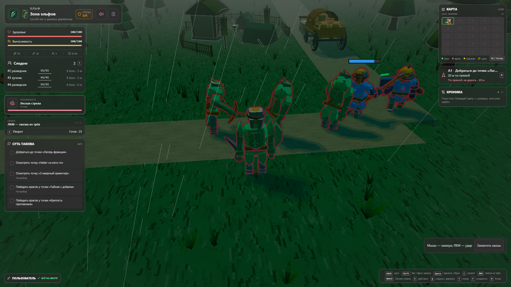
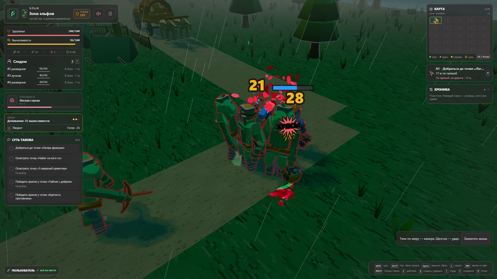
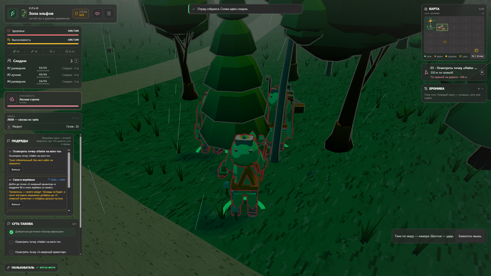
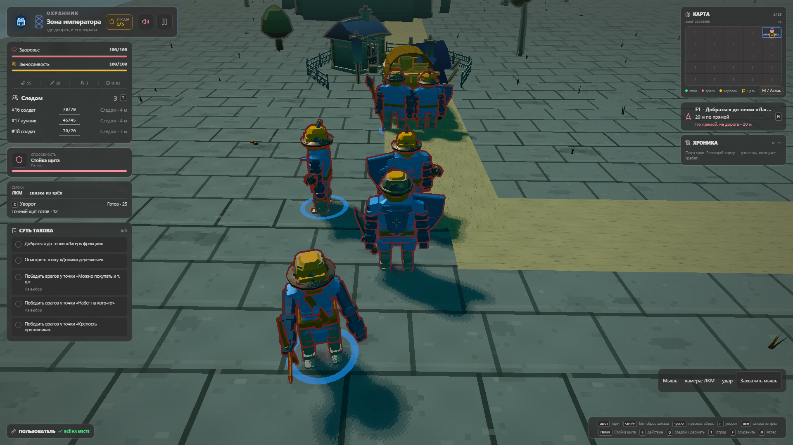
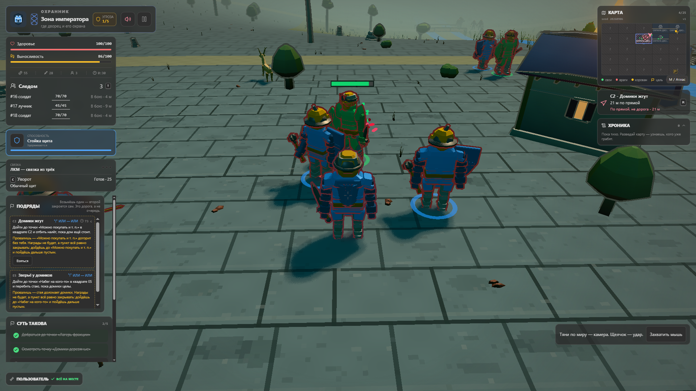
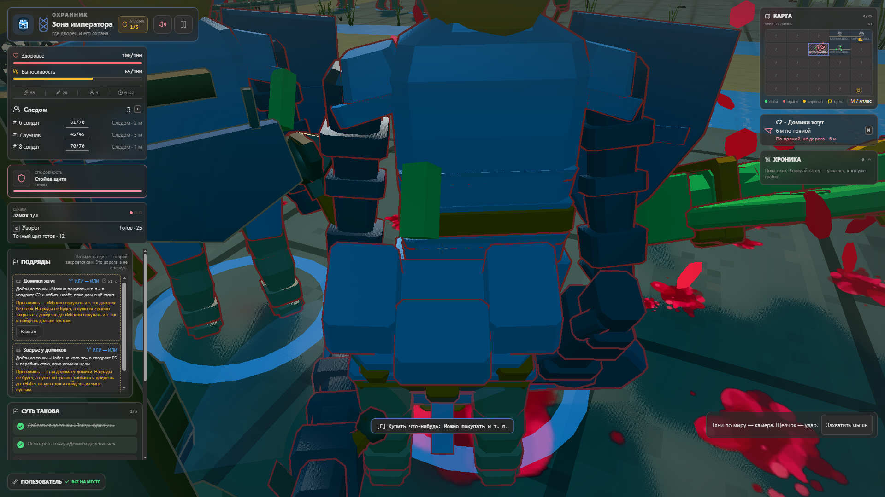
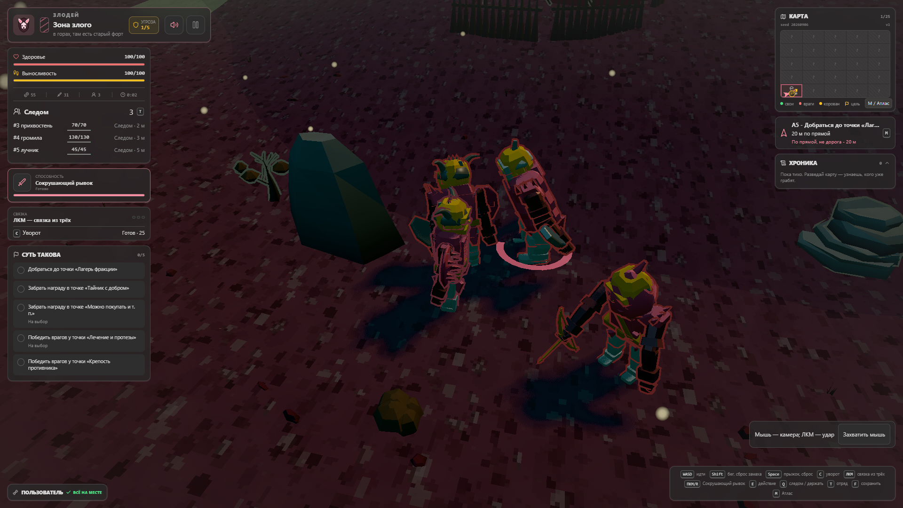
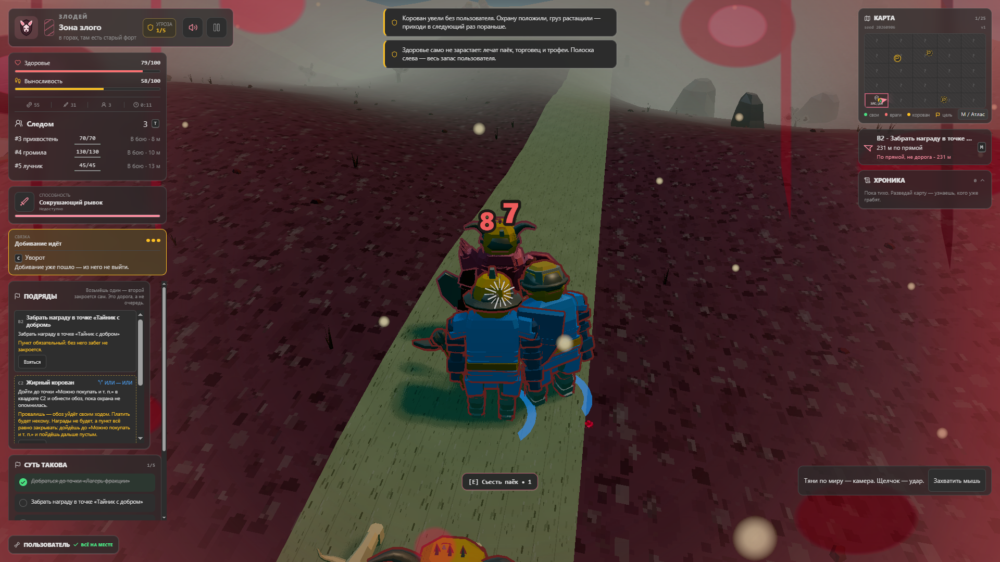
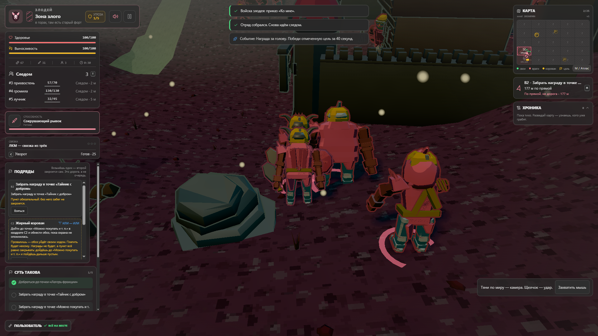

# Three-faction graphics field review

Nine original 1920x1080 gameplay screenshots, with the player and NPCs in every
frame. The problem captures intentionally retain obstruction and cropping.
These are the current game, not generated concepts or promised upgrade results.

**Baseline:** `f36ee7ce06c9cf7b1c220d04b707be4fcf1cc7ff`.
**Seed:** `20260906`. **Settings:** DPR 1, dark UI, high foliage, bloom and ink on,
dynamic time/weather and camera effects on. Chrome 152 on Windows.

[Read the graphical upgrade plan](15-next-gen-graphics-plan.md) |
[Capture metadata and SHA-256 hashes](images/graphics-review/capture-manifest.json)

The three runs used native keyboard/mouse input and supported drag-to-look in
an isolated profile. No gameplay state was rewritten to stage these scenes.
They lasted approximately 32, 43, and 34 active game seconds, with pauses between
observations. They were not full campaign completions. Times below are adjacent
engine samples; the HUD can update slightly later.

## Forest elves

### Opening: player, companions, and caravan guards

Approximately 2.1 s. The player is in the foreground center, with three elf
companions and two blue-clad guards nearby. Rain, foliage, road, camp, and caravan
are all visible. Dark surfaces and colored contours dominate the characters.

### Caravan melee

Approximately 4.5 s. The player and companions are in a close skirmish with the
guards. This is useful evidence for silhouette separation and the overlap of
ink, hit effects, bodies, and damage numbers.

### Foreground foliage obstruction

Approximately 23.5 s. The player has traveled to the B2 contract area and regrouped
the squad. A large conifer obscures nearby companions. Keep this as a visibility
regression scene, not as a successful beauty shot.

## Palace guard

### Opening: player and guard formation

Approximately 2.6 s. The centered player, companions, and caravan escorts show the
guard equipment at several distances. The extended paving makes ground repetition
especially easy to assess.

### Riverside skirmish

Approximately 31.2 s. The player is holding the shield while companions engage
an elf. More NPCs, a deer, a building, water, and a distant bridge provide context.
This frame demonstrates shield use, not proof of a successful perfect guard.

### Collision camera compressed into the formation

Approximately 43.0 s. Near the riverside shop, the camera has been pushed very
close. The player is cropped in the foreground, an allied guard fills the center,
and a defeated elf is visible at the right. The view no longer presents a usable
overview of the fight. This is the camera priority in the upgrade plan.

## Villain

### Opening: player and three companion roles

Approximately 2.4 s. The player near the center is joined by a minion, brute,
and archer. Their proportions, horns, equipment, and pink faction accents can be
compared against the elf and guard openings.

### Catching the caravan

Approximately 11.6 s. After pursuing the moving caravan, the player takes damage
from two guards while companions catch up. The screenshot retains the damage
overlay and crowded silhouettes. Later in the run, an ordinary ration interaction
restored the player's health.

### Highland stronghold and regrouped squad

Approximately 30.5 s. After the raid, the player traveled north and regrouped the
companions outside the old stronghold. The frame exposes rock/soil repetition,
wall shading, sloped ground, and equipment readability together. This was not
a completed finale encounter.

