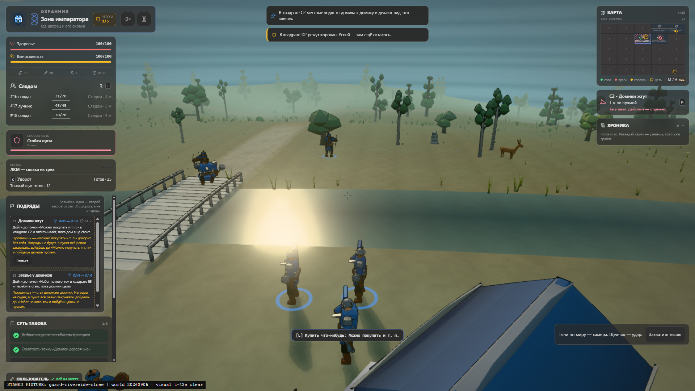
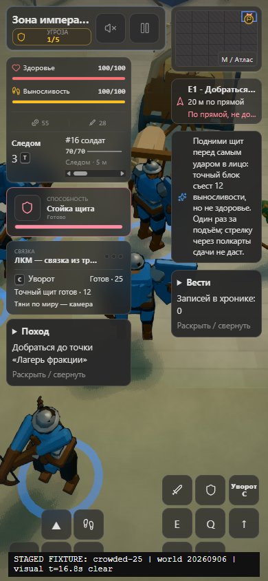

# Enhanced graphics preview: integrated results

**The local opt-in preview is implemented and integrated.** The six original
workstream histories, the later gameplay fixes, and the corrections found during
joined browser runs are preserved. Nothing in this report promotes a hardware
tier or changes the legacy default.

The delivered runtime is `a9a9a857cf087e1e613d61d01870f6353e9a9303`.
The standalone `bundle.html` is 2,108,418 bytes, SHA-256
`433289f38b6b77fb256e4540974ca8372caeb34e754f617a3ce9e53a75bc308a`.
[The evidence index](images/graphics-upgrade/evidence.json) records the source
commit and unmodified PNG hash for every image, plus the measured results.

Select **Улучшенная (предпросмотр)** in the menu or pause visual settings.
During a run, apply a mode/quality change by saving to **В главное меню** and
continuing the campaign. **Боевой интерфейс** changes the Full/Compact HUD live.
See [visual preferences](visual-settings.md) for the complete behavior.

## What is included

**Area:** Rendering and camera

- **Integrated change:** Shared physical-surface toon response, neutral structural ink, bounded world shadows,
  final-image FXAA, collision/terrain-safe camera recovery that also checks requested-view player framing

**Area:** Characters and creatures

- **Integrated change:** Articulated procedural bodies, fitted faces/headgear, connected equipment,
  injury/prosthetic-aware geometry, projected detail levels, and consistent creatures and caravans

**Area:** World

- **Integrated change:** World-scale terrain detail, localized paving, layered vegetation, grounded construction and
  water/bridge cues; canonical terrain, collision and squad sight remain separate

**Area:** Atmosphere and combat

- **Integrated change:** Shared weather/surface response, contact-directed feedback, a bounded secondary pool, and
  admission that reserves real sky/star/flame submissions before cosmetics

**Area:** Interface

- **Integrated change:** Optional compact mission/news disclosures, mobile notices outside vital/navigation controls,
  and the original desktop finale notice lane

**Area:** Compatibility

- **Integrated change:** True vertical view/aim and movement corrections, persisted NPC injury randomness, idempotent
  unchanged Chronicle saves, real bloom-off/Low direct rendering, and offline delivery

**Area:** Diagnostics

- **Integrated change:** Actual same-frame source/pass submissions and live allocation receipts, with explicit unknown
  ownership, partial coverage and provisional budget assessment

The character direction was explicitly approved after the three-faction
`f61ce8d` gallery. Subsequent Balanced/Low NPC optimizations retain the approved
direction, anatomy, equipment and palettes. Low reduces headgear tessellation
and subpixel facial-mark sidewalls while retaining their original fronts;
players, High geometry, and Balanced head geometry are unchanged.

## Actual engine images

The portraits and openings below are explicitly staged, held production views,
not concept images or claims of completed campaigns. Opening images include
the player and actual NPCs. Click an image to inspect its original pixels.

| Forest elves | Palace guard | Villain |
| --- | --- | --- |
| ![Elf portrait][elf-face] | ![Guard portrait][guard-face] | ![Villain portrait][villain-face] |
| ![Elf opening][elf-play] | ![Guard opening][guard-play] | ![Villain opening][villain-play] |

[elf-face]: images/graphics-upgrade/elf-character.png
[guard-face]: images/graphics-upgrade/guard-character.png
[villain-face]: images/graphics-upgrade/villain-character.png
[elf-play]: images/graphics-upgrade/elf-opening.png
[guard-play]: images/graphics-upgrade/guard-opening.png
[villain-play]: images/graphics-upgrade/villain-opening.png

### Camera recovery

The earlier joined river route left the player's upper torso outside the image
at approximately NDC `[-1.19, -0.59]`, even while all physical sight probes were
clear. The corrected solver considers framing in the actual requested
yaw/pitch/roll when selecting and retaining a camera pose; it does not move the
player or replace true aim with an unconditional look-at-player orientation.

The joined correction kept the player framed in all 300 steady route samples
and all 12 subsequent ordered motion frames. Nine warm-up frames were briefly
constrained near the roof; those are not relabeled as an always-visible-camera
pass. The interaction prompt can still overlap the waist, and water glare
remains visible.

### Mobile notice placement

The native guard teaching notice previously covered health/stamina at 390 CSS
pixels. Compact mode now places it in the bounded right-hand flow after
navigation/finale information. The actual notice has zero intersections with
the measured essential controls, which retain their 44-pixel touch targets.
The separate eight-case Full/Compact, ordinary/finale, desktop/mobile component
layout run also preserves the original desktop finale lane.

## Measured crowded-scene envelopes

These measurements come from the joined runtime `91534f2`, before the subsequent
idempotent-resize and held-capture scheduling corrections. Each tier used 120
warm-up frames and 600 active samples with **25 allocated NPCs in every sample**;
living populations changed naturally during combat. All source/pass counters
reconciled, and steady samples performed no framebuffer readback.

| Tier | Whole-frame draws / limit | Dynamic-art main triangles / limit | Post + effects draws / limit | RAF p95 |
| --- | ---: | ---: | ---: | ---: |
| High | 331 / 700 | 142,824 / 250,000 | 58 / 60 | 17.6 ms |
| Balanced | 325 / 450 | 119,172 / 120,000 | 39 / 40 | 17.6 ms |
| Low | 145 / 300 | 57,086 / 60,000 | 13 / 20 | 17.5 ms |

Whole-frame draws include source, ink, shadow and post submissions. Dynamic
triangles include source and ink, not shadow copies. The independently observed
maxima must not be added as though they came from one frame.

Host: Windows 11, Ryzen 7 5800X, RTX 4070 Ti SUPER, Chrome 152,
ANGLE/D3D11/WebGL2. CPU busy observations were about 15%; the computer was not
declared globally isolated. Low used a 390x844 desktop viewport, not a mobile
device. Actual contact counters and admitted secondary feedback remained
present in all three runs.

**This is not a 60-fps or hardware-tier certification.** High/Balanced RAF p95
did not meet the provisional 16.7-ms target. Earlier more-contended measurements
are retained rather than used to claim a causal speedup. Balanced's geometry
headroom in this fixture is small; different role mixtures and viewpoints still
need their own measurements.

## Persistence, display changes and offline behavior

Native movement, camera/drag fallback, melee, faction input and starting-camp
objectives were exercised for all three factions on the earlier joined build.
No full campaign, completed finale, or comprehensive perfect-guard timing proof
is claimed.

The delivered build was loaded from the actual single-file HTML with the page
network offline. Launch, play, save-to-menu and Continue worked without HTTP
dependencies. The ordinary, non-diagnostics engine also restored a deliberately
lost WebGL context while paused, preserving the saved campaign and resuming
actual rendering. This is the supported paused recovery path, not every possible
driver failure.

Same-engine size/DPR and bloom changes preserve the campaign and paused state.
Late review caught held screenshots whose canvas had been cleared by viewport
notifications. Canvas sizing is now idempotent, and held capture helpers let
ResizeObserver delivery settle before drawing. The final mobile/desktop
captures retain the world as well as the HUD; earlier black-frame artifacts
remain in the local evidence rather than being called successful visual proof.

## Remaining promotion gates

Legacy stays the default. Physical mobile/integrated hardware, sustained thermal
behavior, and full frame-time approval remain open. The allocation report also
keeps unexposed caches, unmapped/unuploaded backing stores, temporary peaks,
disjoint presentation CPU scopes and driver storage explicitly incomplete.
Repeated menu cycles showed stable residual API storage, not zero resident VRAM.

The original [field gallery](graphics-review.md),
[baseline](graphics-baseline-results.md), and
[foundation failures](gfx-02-results.md) retain their original attribution.
Local raw run directories, failed iterations and ownership-cleanup receipts are
preserved in the recovery session artifacts. New browser runs require no graphics
lease or approval handshake; ordinary timeouts and cleanup of owned processes
still apply.
